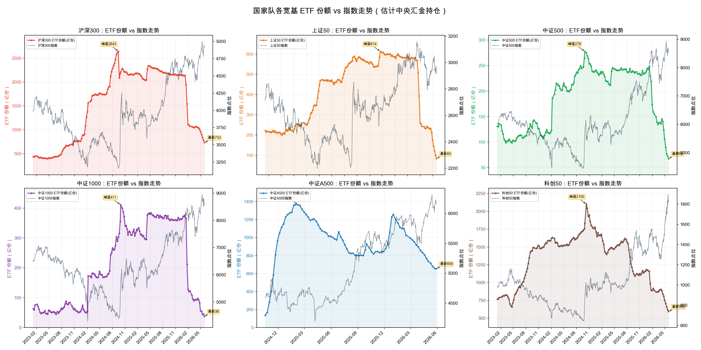

# national-team-position · 国家队持仓估计

一个 [Claude Code](https://claude.com/claude-code) Agent Skill：通过追踪上交所核心**宽基 ETF 份额**变化，估计中国 A 股「国家队」（中央汇金）的持仓变动与结构轮动，并生成可视化图表。

> A Claude Code Agent Skill that estimates China's "national team" (Central Huijin) broad-base ETF positioning by tracking Shanghai Stock Exchange ETF share changes, and renders charts.

## 它能做什么

- 覆盖六大上交所宽基：**沪深300 / 上证50 / 中证500 / 中证1000 / 中证A500 / 科创50**
- 追踪 ETF **份额**（而非规模，已排除价格涨跌干扰），更真实地反映净买卖行为
- 输出一张**六合一总图** + 六张**各指数单图**（每张 = 该宽基份额 + 对应指数价格双轴）+ JSON 数据
- 能区分「真减仓」与「换仓轮动」（例如沪深300 见顶后资金是否流向新发的中证A500）

### 示例输出



> 上图为 2023 至今的六合一总图：每格的彩色线是该宽基的 ETF 份额（左轴，估计国家队持仓），灰线是对应指数价格（右轴）。

| 文件 | 内容 |
|------|------|
| `national_team_overview.png` | 六合一总图（2×3） |
| `national_team_hs300/sse50/csi500/csi1000/csiA500/star50.png` | 各指数单图 |
| `national_team_position.json` | 各宽基份额时间序列 + 全宽基合计 |

## 安装

本仓库即一个独立 skill，直接克隆到 Claude Code 的 skills 目录：

```bash
git clone https://github.com/Xiaoyuan-Liu/national-team-position.git \
  ~/.claude/skills/national-team-position
```

安装依赖：

```bash
pip install akshare matplotlib pandas
```

> macOS 自带中文字体；Linux 需自备中文字体（如 `fonts-noto-cjk`），否则图中中文会显示为方块。

## 使用

在 Claude Code 中直接说「**看看国家队持仓**」「**国家队最近在加仓还是减仓**」即可自动触发，
或手动执行脚本：

```bash
# 推荐看 2023 至今，完整覆盖「建仓 → 轮动 → 撤离」
python ~/.claude/skills/national-team-position/scripts/national_team_position.py \
  --start 2023-01-01 --output-dir ./
```

| 参数 | 说明 |
|------|------|
| `--start` / `--end` | 日期范围 `YYYY-MM-DD`，默认 2024-01-01 ~ 今天 |
| `--output-dir` | 输出目录，默认当前目录 |
| `--freq` | 采样频率 `weekly`（默认）/ `monthly` |
| `--data-only` | 仅输出 JSON，不画图 |

## 原理

中央汇金是宽基 ETF 的绝对控盘方，其申赎会直接体现在 ETF **份额**上。脚本按周（或按月）从
上交所 ETF 份额接口（经 [AKShare](https://github.com/akfamily/akshare) 封装的 `fund_etf_scale_sse`，
一次调用即返回当日全部 ETF）采样各宽基份额，并叠加各指数日线走势。

## 局限与免责声明

### 为什么只统计上交所、不含深交所（创业板、深市中证1000 / A500 等）

**这不是「深市没有数据」，而是沪深两个交易所的公开披露机制不同。** 本工具依赖 AKShare 封装的交易所官方 ETF 份额接口，而两市接口能力不对等：

| | 上交所 `fund_etf_scale_sse` | 深交所 `fund_etf_scale_szse` |
|---|---|---|
| 函数签名 | `(date=...)` —— **可指定历史日期** | `()` —— **无任何参数** |
| 数据源 | 上交所官网**按日归档**的全市场 ETF 份额 | 深交所基金列表页，只有**当前份额快照** |
| 能取到 | 任意历史交易日 → **可构建时间序列** | 仅最新一天 → **无法回溯历史** |

- 上交所每日把全市场 ETF 份额按日期存档，因此可以逐周回溯到 2023 年、画出完整轨迹；
- 深交所官网只展示「当前」份额（`fund_etf_scale_szse()` 连 `date` 参数都没有），没有公开的按日历史归档，拿不到历史，自然无法进这张时间序列图。

**受影响的标的**：创业板（159915 等）、深市的中证1000（159845）、深市的中证A500（159338）等全部未纳入；其中图里**中证1000 因漏掉深市那只规模较大的 ETF 而偏低**，看趋势可以，绝对值会低估。

**若要补全深市历史份额**，可考虑：① ETF 季报 / 半年报披露的份额（仅季度频率，画不出周线）；② Wind / Choice / 同花顺 iFinD 等付费数据源（有深市 ETF 历史份额）；③ 从现在起每日归档 `fund_etf_scale_szse()` 快照，仅能积累**未来**数据，过去补不回。

### 其他局限

- 份额变化含非国家队的散户/机构申赎，**科创50 / 中证500 / 中证A500 噪音较大**，绝对值会高估国家队持仓，建议结合增量口径看趋势。
- 上交所接口在节假日/周末无数据，脚本会自动回退到前几个交易日。
- **本工具仅用于数据可视化与研究，不构成任何投资建议。**

## License

[MIT](LICENSE)
